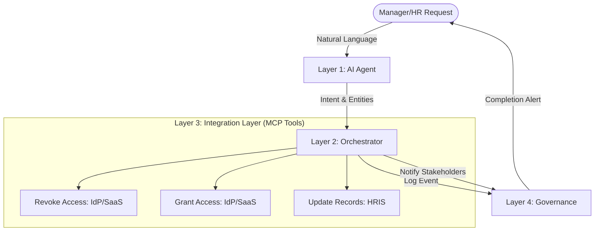

# Employee Lifecycle Automation System - Workflow Overview

The system follows a modular 4-layer architecture designed to automate employee transitions (onboarding, offboarding, transfers) using AI and the Model Context Protocol (MCP).

## High-Level Workflow

## The Four Layers

### 1. Entry & Intelligence Layer (`agent.py`)
- **Action**: Receives natural language from the Chat UI.
- **Process**: 
    - **Intent Classification**: Identifies the action (e.g., "Team Transfer", "Onboarding").
    - **Entity Extraction**: Pulls details like employee name, target team, and role.
    - **Confidence Score**: Validates the request before execution.

### 2. Orchestration Layer (`orchestrator.py`)
- **Action**: Acts as the "operational brain" that manages the sequence of events.
- **Process**: 
    - Follows a **"Revoke-then-Grant"** protocol to ensure security.
    - Selects the appropriate MCP tools based on the parsed intent.
    - Manages the lifecycle of the request from start to finish.

### 3. Integration Layer (`integrations.py` & `mcp/tools.py`)
- **Action**: Executes precise changes in external systems via mock adapters.
- **Systems Covered**:
    - **Identity Provider (IdP)**: Active Directory group memberships.
    - **SaaS Tools**: GitLab/GitHub project access and user creation.
    - **HRIS**: Workday records for hiring, termination, and department updates.

### 4. Governance & Observability Layer (`governance.py`)
- **Action**: Ensures compliance and transparency.
- **Process**:
    - **Immutable Audit Log**: Every step is saved to `audit_log.json`.
    - **Real-time Notifications**: Stakeholders are notified of the success or failure of the operation.

## UI Flow
1. **Chat Agent**: Interactive natural language interface.
2. **Audit Logs**: Transparent view of all automated actions.
3. **Integrations**: Dashboard to manage and monitor system connectors.
